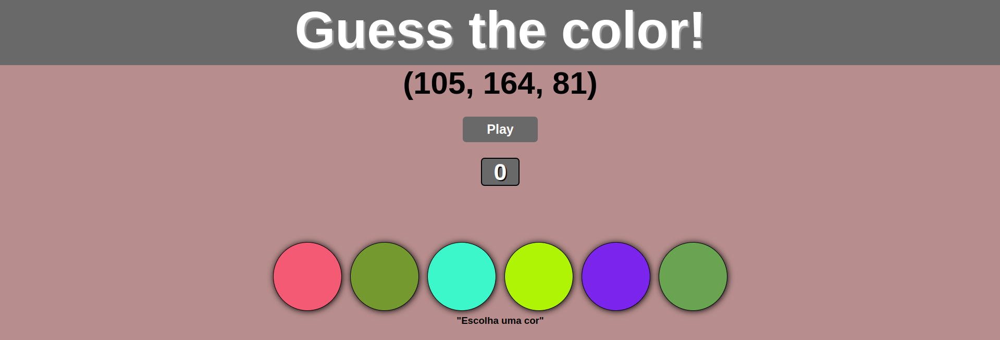
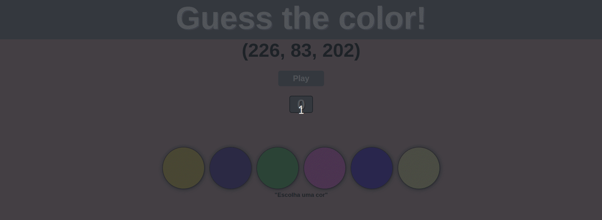

# project-color-guess

## Sobre o Projeto

Projeto que realizei na Trybe,  objetivo desse projeto era criar um mini game que mostra um código RGB e seis cores na tela e a pessoa usuária tem que selecionar a cor correspondente ao código RGB, se a pessoa acerta ganha 3 pontos, caso contrário nada acontece.

(<a href="#readme-top">back to top</a>)

## Construido Com
 1. **HTML**
 2. **CSS**
 3. **JavaScript**
 4. **DOM**

(<a href="#readme-top">back to top</a>)

## Uso

(<a href="#readme-top">back to top</a>)

## Contato

Renan Fernandes - [Linkedin](https://www.linkedin.com/in/orenanfernandes/)

Project Link: https://github.com/RenanFernandess/project-color-guess

(<a href="#readme-top">back to top</a>)

